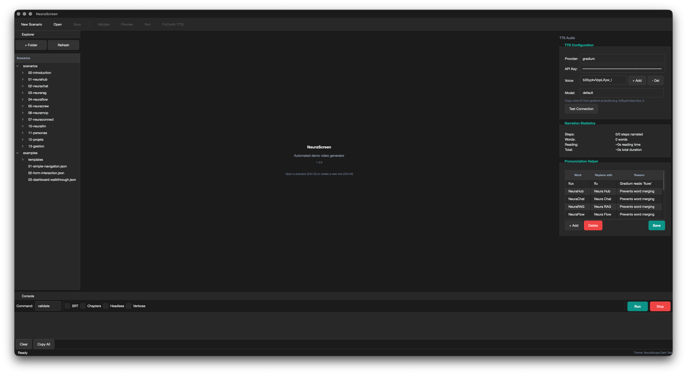
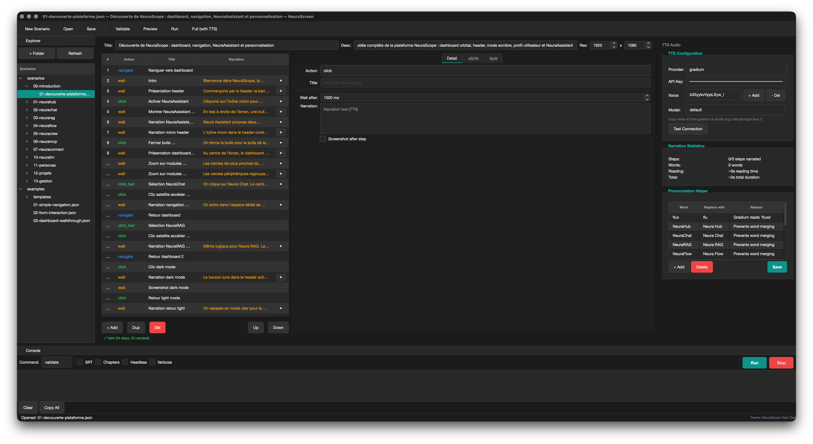
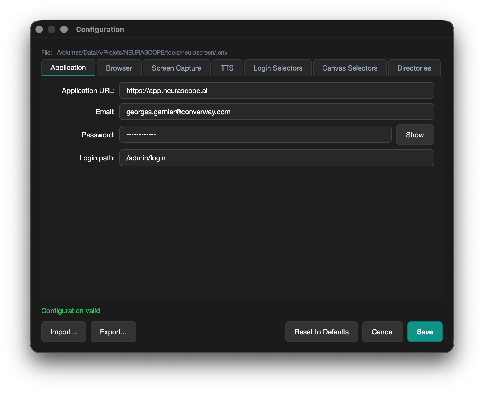
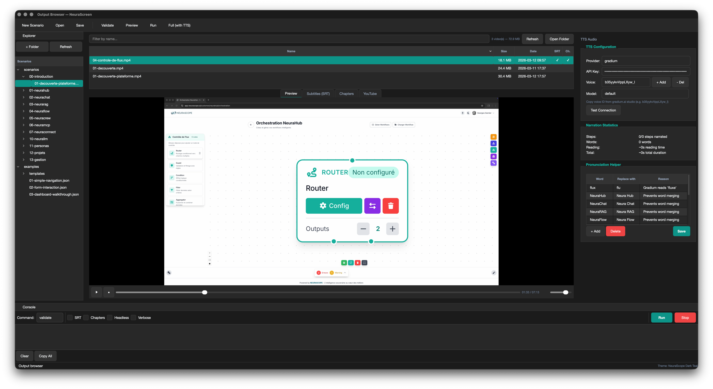
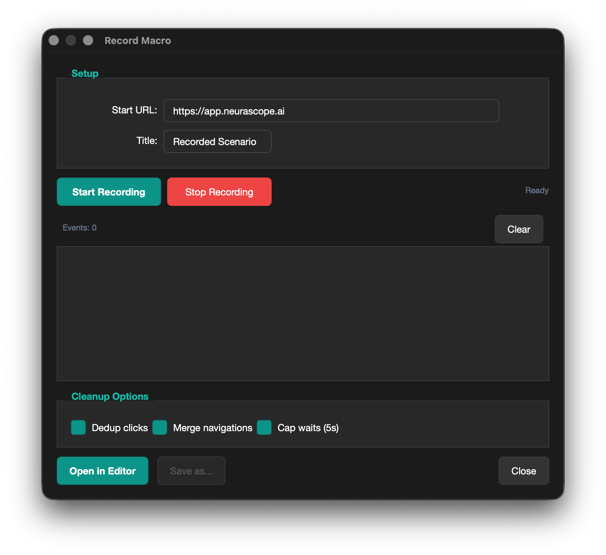
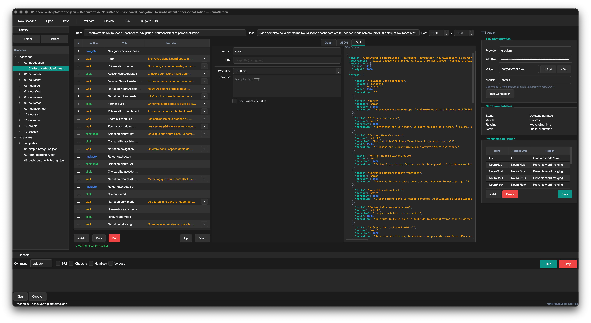

# NeuraScreen


**Automated demo video generator for web applications.**

Write a JSON scenario describing browser actions and narration text. NeuraScreen drives a real browser, captures the screen, generates voiceover with TTS and produces a ready-to-publish video automatically.

```
JSON scenario  -->  Playwright browser  -->  Screen capture  -->  TTS narration  -->  MP4 video
```

---

## Why NeuraScreen?

Creating product demo videos is slow, repetitive and hard to maintain.

- Recording a 5-minute walkthrough takes an hour of preparation, retakes and editing
- Every UI change means re-recording the entire video
- SaaS teams need dozens of demo videos across features, languages and versions
- Keeping tutorials in sync with the actual product is a constant effort

**NeuraScreen solves this.** Describe your demo as a JSON scenario. The tool records the real browser, narrates with AI voice, and outputs a ready-to-publish MP4. When the UI changes, update the scenario and regenerate.

---

## Typical Use Cases

- **Product demo videos** for marketing pages and sales decks
- **SaaS onboarding tutorials** for new users
- **Documentation walkthroughs** with step-by-step narration
- **Release videos** showcasing new features
- **Internal training** for product and support teams
- **Automated tutorial generation** at scale using AI-written scenarios

---

## Demo

Watch NeuraScreen generate a full demo video from a JSON scenario — preview, TTS narration, browser automation, screen capture and final MP4:

[](https://youtu.be/yY05VSue5BI)

`9m29 video` · `67 automated steps` · `12 narrated segments` · `8 drag & drop interactions` · `0 manual editing`

---

## Desktop GUI

NeuraScreen includes an optional desktop application (PySide6) for editing scenarios, previewing TTS audio and managing configuration visually.

| Welcome | Editor | Configuration |
|---------|--------|---------------|
|  |  |  |

| Output Browser | Macro Recorder | JSON + Split View |
|----------------|----------------|-------------------|
|  |  |  |

Install with GUI support: `pip install neurascreen[gui]` then launch with `neurascreen gui`.

---

## Quick Start

### 1. Install

**Via pip (recommended):**

```bash
pip install neurascreen
playwright install chromium
```

With optional extras:

```bash
pip install neurascreen[gradium]    # For Gradium TTS
pip install neurascreen[gui]        # For desktop GUI (PySide6)
pip install neurascreen[all]        # Everything
```

**From source:**

```bash
git clone https://github.com/NEURASCOPE/neurascreen.git
cd neurascreen
pip install -e ".[dev]"
playwright install chromium
```

### 2. Configure

```bash
cp .env.example .env
```

Edit `.env`:

```env
APP_URL=http://localhost:3000
TTS_PROVIDER=openai
TTS_API_KEY=sk-...
TTS_VOICE_ID=alloy
```

### 3. Generate your first video

```bash
# Validate the scenario
neurascreen validate examples/01-simple-navigation.json

# Preview in browser (no recording)
neurascreen preview examples/01-simple-navigation.json

# Generate video with narration
neurascreen full examples/01-simple-navigation.json
```

Output: `output/01-simple-navigation.mp4`

---

## Example Workflow

### Step 1 — Write a scenario

```json
{
  "title": "Dashboard Overview",
  "description": "Quick tour of the main dashboard",
  "resolution": { "width": 1920, "height": 1080 },
  "steps": [
    { "action": "navigate", "url": "/dashboard", "wait": 2000 },
    { "action": "wait", "duration": 1000,
      "narration": "This is the main dashboard. It shows all active projects and recent activity." },
    { "action": "click_text", "text": "Analytics", "wait": 1500 },
    { "action": "wait", "duration": 1000,
      "narration": "The analytics tab provides real-time metrics and usage trends." },
    { "action": "scroll", "selector": "main", "direction": "down", "amount": 400, "wait": 1000 },
    { "action": "wait", "duration": 1000,
      "narration": "Detailed reports are available at the bottom of the page." }
  ]
}
```

### Step 2 — Validate

```bash
neurascreen validate my-scenario.json
```

### Step 3 — Generate

```bash
neurascreen full my-scenario.json
```

The output MP4 is in `output/`.

---

## How it works

1. You write a **JSON scenario** with browser actions and narration text
2. The **TTS engine** pre-generates audio for each narration step
3. **Playwright** drives a real Chromium browser through the steps
4. **ffmpeg** captures the screen natively in high quality (5K on Retina displays)
5. Each narration audio is **played in real-time** during capture for perfect synchronization
6. The assembler **crops/scales** to 1920x1080 and merges the audio track

---

## Generating Scenarios with AI

The JSON format is designed to be easily generated by large language models. You describe what you want, the LLM writes the scenario, NeuraScreen produces the video.

### Compatible models

| Model | Best for |
|-------|----------|
| **Claude Code** | Browse your app live, inspect elements, write the scenario |
| **ChatGPT (GPT-4o)** | Write scenarios from descriptions or screenshots |
| **Mistral** | Good for multilingual narration text |
| **Gemini** | Multimodal: generate scenarios from screenshots |
| **Ollama (local)** | Privacy-sensitive projects, offline usage |
| **OpenRouter** | Access multiple models via one API |

### Example prompt

```
I need a demo video scenario for my web application.

The app is a project management tool at http://localhost:3000.
The user logs in, sees a dashboard with projects, clicks on a project,
and sees the task list.

Generate a JSON scenario for NeuraScreen using this format:
- "navigate" to open pages
- "click_text" to click buttons by their visible text
- "click" with CSS selectors for icon buttons
- "wait" with "narration" to describe what's visible on screen
- "scroll" to scroll down

The narration should be professional, concise, and in English.
Start with an intro and end with a conclusion.
```

The LLM produces the JSON. You validate and run it:

```bash
neurascreen validate scenario.json
neurascreen full scenario.json
```

---

## TTS Providers

NeuraScreen supports 5 TTS providers. Configure in `.env`.

### OpenAI TTS (recommended)

High quality, multilingual, fast, simple API.

```env
TTS_PROVIDER=openai
TTS_API_KEY=sk-...
TTS_VOICE_ID=alloy
TTS_MODEL=tts-1-hd
```

Voices: `alloy` `echo` `fable` `onyx` `nova` `shimmer`
Models: `tts-1` (fast) or `tts-1-hd` (high quality)

### ElevenLabs

Best voice quality, voice cloning, many voices.

```env
TTS_PROVIDER=elevenlabs
TTS_API_KEY=sk_...
TTS_VOICE_ID=21m00Tcm4TlvDq8ikWAM
TTS_MODEL=eleven_multilingual_v2
```

### Gradium

French-focused TTS with natural voices.

```env
TTS_PROVIDER=gradium
TTS_API_KEY=gsk_...
TTS_VOICE_ID=b35yykvVppLXyw_l
TTS_MODEL=default
```

### Google Cloud TTS

Enterprise-grade, many languages, Neural2 voices.

```env
TTS_PROVIDER=google
TTS_API_KEY=your-api-key
TTS_VOICE_ID=fr-FR-Neural2-A
```

### Coqui TTS (self-hosted)

Free, open source, runs locally. No API key needed.

```env
TTS_PROVIDER=coqui
TTS_API_KEY=http://localhost:5002
TTS_VOICE_ID=default
```

---

## Scenario Format

### Actions

| Action | Description | Required fields |
|--------|-------------|-----------------|
| `navigate` | Open a URL | `url` |
| `click` | Click by CSS selector | `selector` |
| `click_text` | Click by visible text | `text` |
| `type` | Type into a field | `selector`, `text` |
| `scroll` | Scroll an element | `selector`, `direction`, `amount` |
| `hover` | Hover an element | `selector` |
| `key` | Press a keyboard key | `text` |
| `wait` | Pause with narration | `duration` |
| `drag` | Drag item to canvas | `text` |
| `delete_node` | Delete last canvas node | -- |
| `close_modal` | Close current modal | -- |
| `zoom_out` | Zoom out N times | `amount` |
| `fit_view` | Fit view to content | -- |

### Step fields

| Field | Type | Default | Description |
|-------|------|---------|-------------|
| `title` | string | `""` | Step name for logging |
| `action` | string | -- | Action to perform (required) |
| `url` | string | -- | URL (relative or absolute) |
| `selector` | string | -- | CSS selector |
| `text` | string | -- | Text content |
| `wait` | int | `1000` | Pause after action (ms) |
| `duration` | int | `1000` | Wait duration (ms) |
| `narration` | string | `""` | TTS narration text |
| `direction` | string | -- | `"up"` or `"down"` |
| `amount` | int | `300` | Scroll pixels or zoom count |

### Recommended pattern

Perform actions silently, then narrate what is visible:

```json
{ "action": "navigate", "url": "/settings", "wait": 2000 },
{ "action": "wait", "duration": 1000, "narration": "The settings page." }
```

---

## Configuration

All settings are in `.env`. See [`.env.example`](.env.example) for the full documented reference.

### Required

| Variable | Description |
|----------|-------------|
| `APP_URL` | Base URL of your web app |

### Authentication (optional)

| Variable | Description |
|----------|-------------|
| `APP_EMAIL` | Login email (empty = skip login) |
| `APP_PASSWORD` | Login password |
| `LOGIN_URL` | Login path (default: `/login`) |

### Video

| Variable | Default | Description |
|----------|---------|-------------|
| `VIDEO_WIDTH` | `1920` | Output width |
| `VIDEO_HEIGHT` | `1080` | Output height |
| `VIDEO_FPS` | `30` | Frames per second |
| `BROWSER_HEADLESS` | `false` | Headless mode |

### Screen capture (multi-monitor / multi-platform)

| Variable | Default | Description |
|----------|---------|-------------|
| `CAPTURE_SCREEN` | `0` | ffmpeg screen index (macOS avfoundation) |
| `CAPTURE_DISPLAY` | `""` | Display identifier — Linux: X11 display (e.g. `:0.0`), Windows: `desktop` or `title=Window Name` |
| `BROWSER_SCREEN_OFFSET` | `0` | Browser X pixel offset |

---

## CLI Commands

| Command | Description |
|---------|-------------|
| `neurascreen validate <file>` | Validate scenario JSON |
| `neurascreen preview <file>` | Run in browser without recording |
| `neurascreen run <file>` | Record video without narration |
| `neurascreen full <file>` | Record with TTS narration |
| `neurascreen batch <folder>` | Generate videos from all scenarios in a folder |
| `neurascreen record <url>` | Record browser interactions → JSON scenario |
| `neurascreen list` | List available scenarios |
| `neurascreen voices list` | List configured TTS voices per provider |
| `neurascreen voices add <provider> <id> <name>` | Add a voice to a provider |
| `neurascreen voices remove <provider> <id>` | Remove a voice |
| `neurascreen voices set-default <provider> <id>` | Set default voice for a provider |
| `neurascreen --version` | Show version |
| `neurascreen gui` | Launch desktop GUI (requires `[gui]` extra) |

Options: `--verbose` / `-v` for debug output, `--headless` for headless mode, `--srt` for subtitle generation, `--chapters` for YouTube chapter markers.

### Voice management

Voices are stored per provider in `~/.neurascreen/voices.json` (shared with the GUI). If `TTS_VOICE_ID` or `TTS_MODEL` are not set in `.env`, the CLI uses defaults from `voices.json`.

```bash
neurascreen voices list                          # List all voices
neurascreen voices list -p openai                # Filter by provider
neurascreen voices add gradium abc123 "My voice" # Add a voice
neurascreen voices set-default openai nova       # Set default
neurascreen voices remove gradium abc123         # Remove
```

You can also use `python -m neurascreen` instead of `neurascreen`.

---

## Desktop GUI

NeuraScreen includes an optional desktop interface built with PySide6.

### Install

```bash
pip install neurascreen[gui]
```

### Launch

```bash
neurascreen gui
```

### Features

- **Scenario editor** — visual step list with drag-reorder, adaptive detail panel for all 14 action types, JSON source view with syntax highlighting, split view
- **File browser** — sidebar tree view of your scenario folders, double-click to open
- **Execution panel** — run validate/preview/run/full from the GUI with real-time colored console output
- **Configuration manager** — visual .env editor with 7 tabs (Application, Browser, Screen Capture, TTS, Selectors, Directories), validation, import/export
- **TTS & audio preview** — per-provider voice config (`~/.neurascreen/voices.json`), per-step audio preview, pronunciation helper, narration statistics
- **Output browser** — browse generated videos with integrated video player (QMediaPlayer), SRT subtitles viewer, YouTube chapters viewer
- **Macro recorder** — record browser interactions from the GUI with live event feed, cleanup options, and direct import into the editor (Ctrl+R)
- **Selector validator** — verify scenario selectors against the real DOM using Playwright headless, with found/not found/multiple status and suggestions (Ctrl+Shift+V)
- **Scenario statistics** — steps count, actions breakdown, narration metrics, estimated duration, unique URLs and selectors
- **Scenario diff** — compare two scenario files side by side with added/removed/modified/unchanged status
- **Autosave & recovery** — periodic autosave every 60s, recovery prompt on startup
- **Theme engine** — dark teal (default) and light themes with full Fusion style support, switchable via Ctrl+T. Create custom themes as JSON files in `~/.neurascreen/themes/`
- **Step templates** — insert common patterns (navigation, drag & configure, form fill) from the context menu
- **Undo/redo** — full undo history for all editing operations
- **Keyboard shortcuts** — 20+ shortcuts including Ctrl+N/O/S, F5-F8, Ctrl+R (record), Ctrl+Shift+V (validate selectors)

The GUI is optional — the CLI remains the primary interface and works without PySide6.

---

## System Dependencies

### Python 3.12+

Download from [python.org](https://python.org) or use your package manager.

### ffmpeg

| OS | Command |
|----|---------|
| **macOS** | `brew install ffmpeg` |
| **Ubuntu/Debian** | `sudo apt install ffmpeg` |
| **Windows** | `choco install ffmpeg` |

### Playwright Chromium

Installed automatically via `playwright install chromium` after pip install.

---

## Project Structure

```
neurascreen/
├── .env.example          # Configuration template
├── pyproject.toml        # Package metadata & dependencies
├── LICENSE               # MIT
├── README.md
├── neurascreen/          # Python package
│   ├── cli.py            # CLI commands (entry point)
│   ├── config.py         # Configuration loader
│   ├── scenario.py       # JSON parser & validator
│   ├── browser.py        # Playwright browser engine
│   ├── platform.py       # OS detection & platform-specific commands
│   ├── recorder.py       # Screen capture (ffmpeg)
│   ├── subtitles.py      # SRT subtitles & YouTube chapters
│   ├── macro.py          # Macro recorder (browser → JSON)
│   ├── narrator.py       # TTS & timing sync
│   ├── tts.py            # TTS abstraction (5 providers)
│   ├── assembler.py      # Video assembly
│   ├── utils.py          # Helpers
│   └── gui/              # Optional desktop GUI (PySide6)
│       ├── app.py        # QApplication entry point
│       ├── main_window.py # Main window
│       ├── theme.py      # Theme engine (JSON → QSS)
│       ├── themes/       # Theme palettes (dark-teal, light)
│       ├── resources/    # App icons, SVG arrows
│       ├── editor/       # Scenario editor widgets
│       ├── execution/    # Command execution panel
│       ├── config/       # Configuration manager (.env editor)
│       ├── tts/          # TTS panel, audio preview, voices, pronunciation
│       ├── output/       # Output browser, video player, SRT/chapters viewers
│       ├── macro/        # Macro recorder dialog, event feed, cleanup
│       └── advanced/     # Selector validator, statistics, diff, autosave
├── tests/                # Unit tests (pytest)
├── examples/             # Example scenarios
├── docs/                 # Documentation
├── output/               # Generated videos
├── temp/                 # Intermediate files
└── logs/                 # Execution logs
```

---

## Platform Support

| Feature | macOS | Linux | Windows |
|---------|-------|-------|---------|
| Browser automation | Yes | Yes | Yes |
| Screen capture | Yes (avfoundation) | Yes (x11grab) | Yes (gdigrab) |
| Audio playback | Yes (afplay) | Yes (paplay/aplay) | Yes (PowerShell) |
| TTS | Yes | Yes | Yes |
| Video assembly | Yes | Yes | Yes |

---

## Macro Recorder

Generate scenarios by recording your browser interactions instead of writing JSON by hand:

```bash
neurascreen record http://localhost:3000 -t "My demo"
```

A browser opens. Click around normally. Close it when done. The tool outputs a valid JSON scenario.

```bash
# Review and edit the generated scenario
neurascreen validate output/my_demo.json
neurascreen preview output/my_demo.json

# Add narration to wait steps, then generate the video
neurascreen full output/my_demo.json
```

See [docs/macro-recorder.md](docs/macro-recorder.md) for the full guide.

---

## Subtitles & YouTube Chapters

Generate SRT subtitles and YouTube chapter markers alongside your videos:

```bash
# Video + subtitles + chapters
neurascreen full --srt --chapters scenario.json
```

Output:
- `output/scenario.mp4` — the video
- `output/scenario.srt` — subtitles (upload to YouTube Studio or use with VLC)
- `output/scenario.chapters.txt` — chapter markers (paste into YouTube description)

See [docs/subtitles-chapters.md](docs/subtitles-chapters.md) for details.

---

## Batch Mode

Process all scenarios in a folder in one command:

```bash
# With narration
neurascreen batch scenarios/ --srt --chapters

# Without narration (faster)
neurascreen batch scenarios/ --no-narration
```

Validates all scenarios upfront, processes them sequentially, and prints a summary report.

---

## Docker

Run NeuraScreen in a container for headless video generation (no display required):

```bash
# Build
docker build -t neurascreen .

# Generate a video
docker run --rm \
  -v ./scenarios:/app/examples \
  -v ./output:/app/output \
  -e APP_URL=http://host.docker.internal:3000 \
  -e TTS_PROVIDER=openai -e TTS_API_KEY=sk-... -e TTS_VOICE_ID=alloy \
  neurascreen full examples/demo.json --srt --chapters
```

The container includes Xvfb (virtual display) and PulseAudio (audio playback). See [docs/docker.md](docs/docker.md) for CI/CD integration, networking and troubleshooting.

---

## Contributing

See [CONTRIBUTING.md](CONTRIBUTING.md) for how to report bugs, suggest features, add TTS providers or submit pull requests.

## Documentation

| Guide | Description |
|-------|-------------|
| [Scenario Writing Guide](docs/scenario-guide.md) | How to write effective demo scenarios |
| [Cross-Platform Setup](docs/cross-platform.md) | macOS, Linux and Windows configuration |
| [Macro Recorder](docs/macro-recorder.md) | Record browser interactions → JSON |
| [Subtitles & Chapters](docs/subtitles-chapters.md) | SRT subtitles and YouTube chapters |
| [Desktop GUI](docs/gui.md) | Visual scenario editor and execution |
| [Docker](docs/docker.md) | Headless generation in containers |
| [Contributing](CONTRIBUTING.md) | Add TTS providers, actions, or submit PRs |

## Roadmap

See [ROADMAP.md](ROADMAP.md) for planned features.

## License

MIT
