# Desktop GUI

NeuraScreen includes an optional desktop interface for editing scenarios, running commands and previewing output — all without touching the terminal.

## Install

```bash
pip install neurascreen[gui]
```

This installs PySide6 (Qt for Python). The GUI is optional — the CLI works without it.

## Launch

```bash
neurascreen gui
```

## Overview


The GUI has six main areas:

| Area | Description |
|------|-------------|
| **Sidebar** (left) | File browser showing your scenario folders |
| **Editor** (center) | Visual scenario editor with step list and detail panel |
| **Tabs** (right of editor) | Detail view, JSON source view, or split view |
| **TTS Panel** (right dock) | TTS config, voice management, narration stats, pronunciation |
| **Console** (bottom) | Execution output, hidden by default |
| **Output Browser** (center) | Video listing with integrated player, SRT/chapters viewers |

## Editing scenarios


### Create or open

- `Ctrl+N` — new empty scenario
- `Ctrl+O` — open a JSON file
- Double-click a file in the sidebar

### Step list

The left panel shows all steps in a table:

| Column | Content |
|--------|---------|
| # | Step number |
| Action | Action type (colored by category) |
| Title | Step title |
| Narration | Narration text preview |

Actions:
- **+ Add** — insert a new step
- **Dup** — duplicate selected step
- **Del** — delete selected step(s)
- **Up / Down** — reorder steps
- **Right-click** — context menu with all actions + templates

### Detail panel

Click a step to edit it. The form adapts to the action type:

- `navigate` shows URL field
- `click` shows CSS selector field
- `type` shows selector, text and delay fields
- `wait` shows duration field
- `drag` shows item name field
- Actions without parameters show "No parameters"

Common fields (always visible): Wait after, Narration, Screenshot after step.

### JSON view

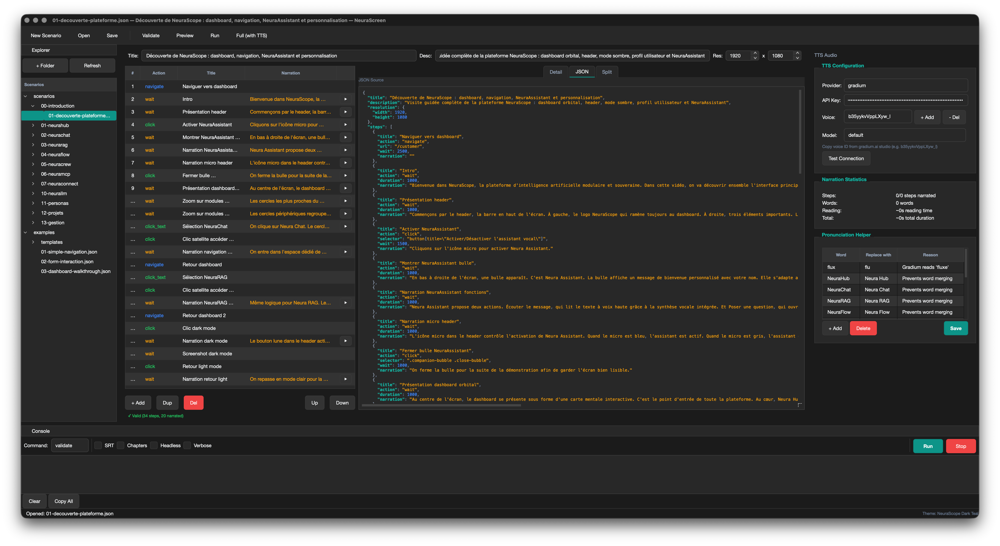

Switch to the **JSON** tab to edit the raw JSON directly. Changes sync bidirectionally with the visual editor. Syntax highlighting colors keys, strings, numbers and booleans.

The **Split** tab shows both views side by side.


### Templates

Right-click in the step list → **Insert template** to add common patterns:

- Navigation + Narration (2 steps)
- Click + Narration (2 steps)
- Form Fill (3 steps)
- Drag + Configure + Delete (7 steps)
- Scroll + Narration (2 steps)
- Introduction / Conclusion (1 step each)

## Running commands

Press **F5**–**F8** or use the **Tools** menu:

| Shortcut | Command | Description |
|----------|---------|-------------|
| F5 | Validate | Check scenario for errors |
| F6 | Preview | Run in browser without recording |
| F7 | Run | Record video without narration |
| F8 | Full | Record with TTS narration |

The console panel opens automatically and shows real-time output. Colored by level: white (info), yellow (warning), red (error), green (success).

Options (checkboxes in the console panel): SRT subtitles, YouTube chapters, headless mode, verbose logging.

When running from the GUI without the Headless checkbox, the browser always opens in headed mode (visible window) regardless of the `.env` setting.

## Configuration Manager

Open via **Tools > Configuration** or **Ctrl+,**.

| Application | Browser | Screen Capture | TTS |
|-------------|---------|----------------|-----|
|  | 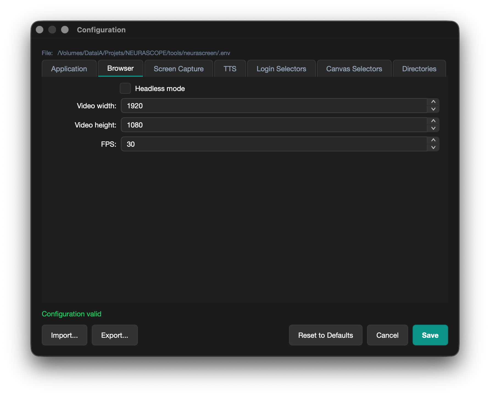 | 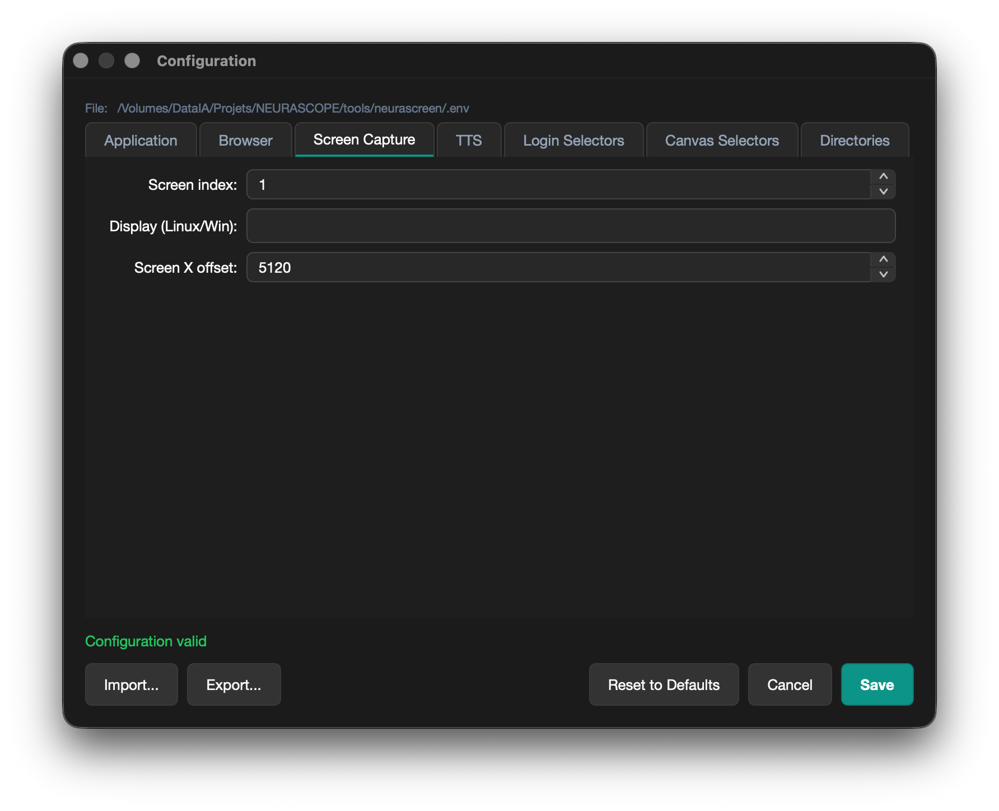 | 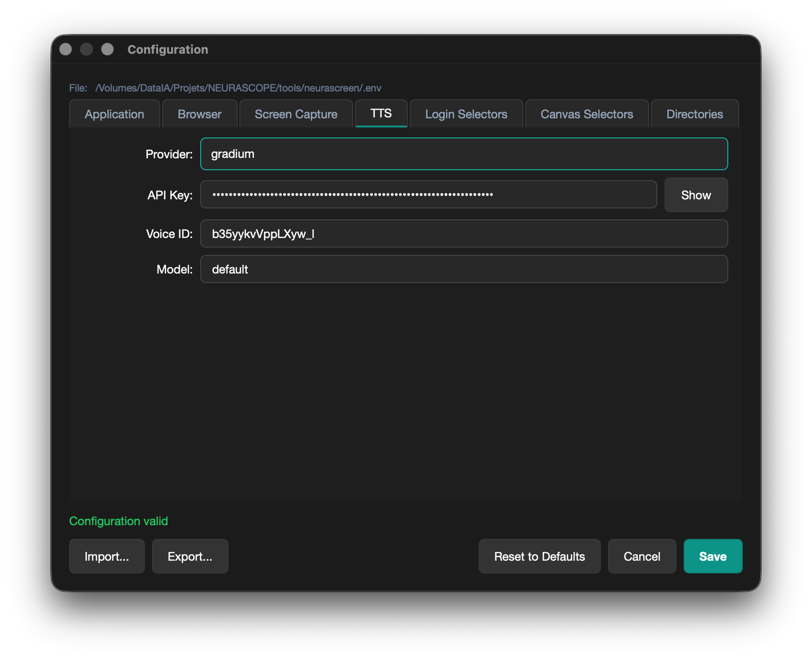 |

| Login Selectors | Canvas Selectors | Directories |
|-----------------|------------------|-------------|
| 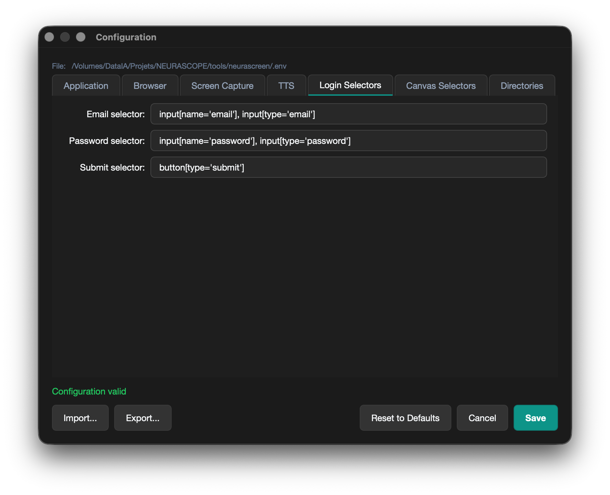 | 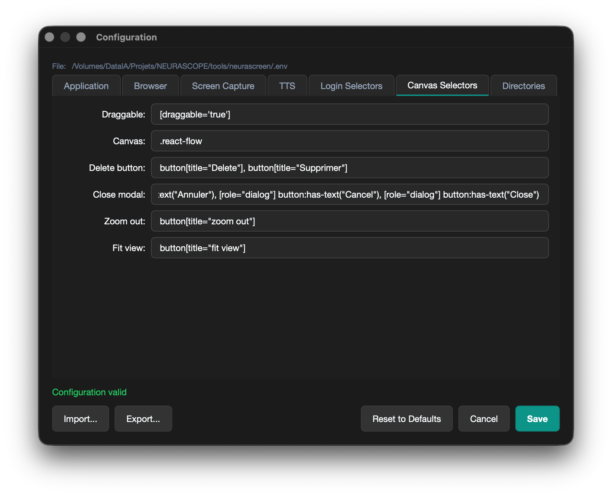 | 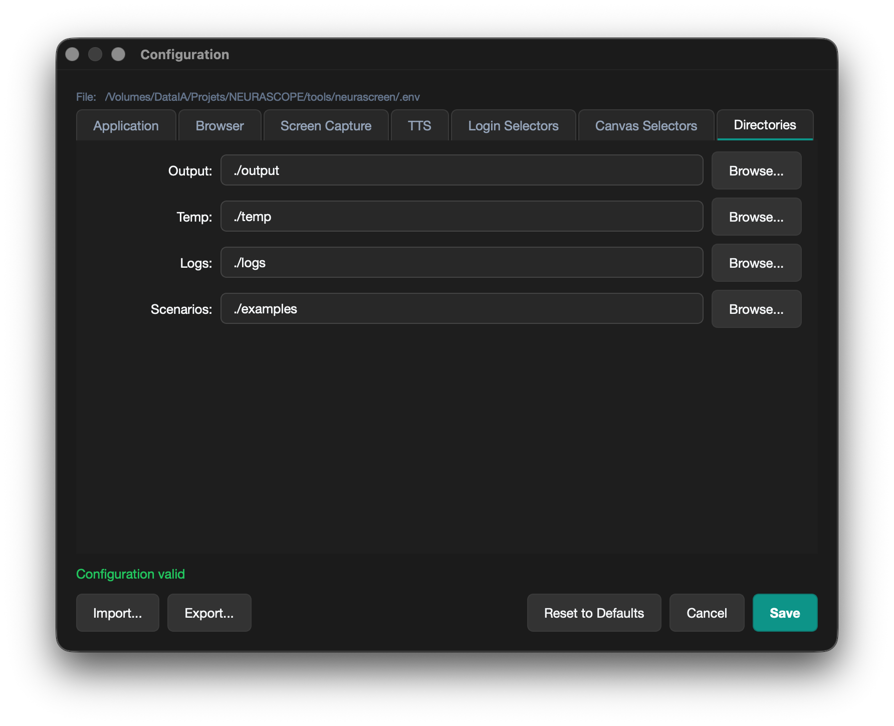 |

The configuration dialog provides a visual editor for all `.env` variables, organized in 7 tabs:

| Tab | Settings |
|-----|----------|
| Application | APP_URL, APP_EMAIL, APP_PASSWORD, LOGIN_URL |
| Browser | BROWSER_HEADLESS, VIDEO_WIDTH, VIDEO_HEIGHT, VIDEO_FPS |
| Screen Capture | CAPTURE_SCREEN, CAPTURE_DISPLAY, BROWSER_SCREEN_OFFSET |
| TTS | TTS_PROVIDER, TTS_API_KEY, TTS_VOICE_ID, TTS_MODEL |
| Login Selectors | LOGIN_EMAIL_SELECTOR, LOGIN_PASSWORD_SELECTOR, LOGIN_SUBMIT_SELECTOR |
| Canvas Selectors | SELECTOR_DRAGGABLE, SELECTOR_CANVAS, SELECTOR_DELETE_BUTTON, etc. |
| Directories | OUTPUT_DIR, TEMP_DIR, LOGS_DIR, SCENARIOS_DIR |

Features: real-time validation, reset to defaults, import/export `.env` files.

## TTS & Audio Preview

Open via **View > TTS Panel** or **Ctrl+Shift+T**.

### Voice configuration

Voices are stored per provider in `~/.neurascreen/voices.json`. Preset voices are included for OpenAI (9 voices), Google Cloud (10 French voices), and Coqui. Use the **+ Add** / **- Del** buttons to manage voices for Gradium, ElevenLabs, or any provider.

### Audio preview

Each narrated step in the step list has a **Play** button. Click it to generate and play the TTS audio for that step. Audio is cached — subsequent plays are instant.

### Pronunciation helper

An editable table of phonetic substitutions (e.g., "NeuraHub" → "Neura Hub" for correct TTS pronunciation). Saved to `~/.neurascreen/pronunciation.json`.

### Narration statistics

The panel shows: steps narrated / total, word count, estimated reading time (~130 words/min), total duration.

## Output Browser

Open via **View > Output Browser** or **Ctrl+Shift+O**.

| Video Player | SRT Subtitles | Chapters |
|-------------|---------------|----------|
|  | 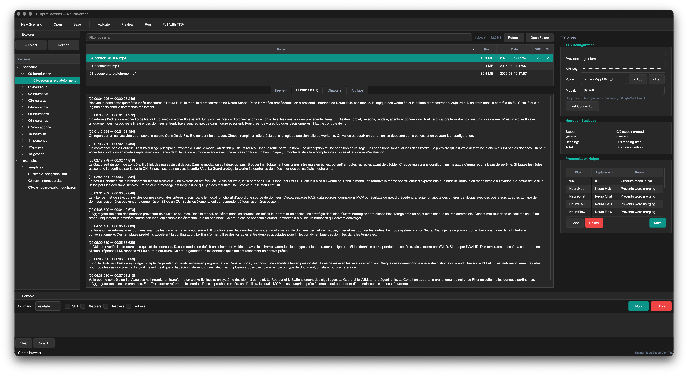 | 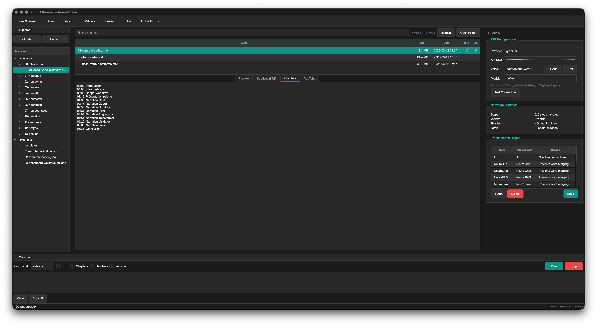 |

Browse generated videos in the `output/` directory:

- **File table** — name, size, date, SRT/chapters indicators, sortable, searchable
- **Video player** — integrated QMediaPlayer with play/pause, seek slider, volume, time display
- **SRT viewer** — formatted subtitle display with timestamps
- **Chapters viewer** — YouTube chapter markers
- **YouTube viewer** — metadata file content

Actions: double-click to play, right-click for context menu (open, copy path, delete), "Open Folder" button.

The file list auto-refreshes when new videos are generated.

## Macro Recorder

Open via **Tools > Record Macro** or **Ctrl+R**.


Record browser interactions and convert them to a scenario:

1. Enter the **Start URL** and an optional **Title**
2. Click **Start Recording** — a Chromium browser opens
3. Interact normally — clicks, navigations, scrolls and key presses are captured
4. The **live event feed** shows captured events in real time (color-coded by type)
5. Close the browser or click **Stop Recording**
6. Review the results and apply **cleanup options**:
   - **Dedup clicks** — remove rapid double-clicks on the same element
   - **Merge navigations** — keep only the last of consecutive navigation events
   - **Cap waits** — limit pauses to 5 seconds, remove pauses under 500ms
7. Click **Open in Editor** to load the scenario directly, or **Save as...** to export as JSON

## Selector Validator

Open via **Tools > Validate Selectors** or **Ctrl+Shift+V** (requires an open scenario).

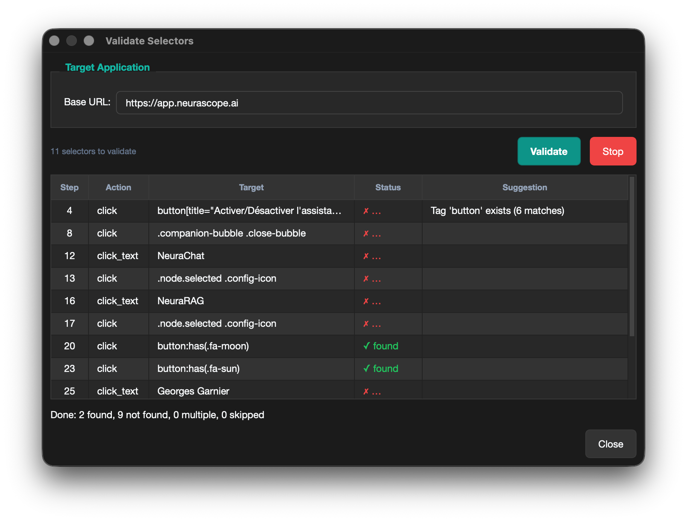

Verifies that all CSS selectors and click texts in your scenario exist in the real DOM:

1. Enter the **Base URL** of your application
2. Click **Validate** — Playwright launches headless and checks each selector
3. Results appear in real time with status:
   - **found** — selector matches exactly one element
   - **not found** — selector not found (with suggestions if a similar selector exists)
   - **multiple** — selector matches more than one element
   - **skipped** — page could not be loaded
4. **Double-click** a result to jump to that step in the editor

## Scenario Statistics

Open via **Tools > Statistics** (requires an open scenario).

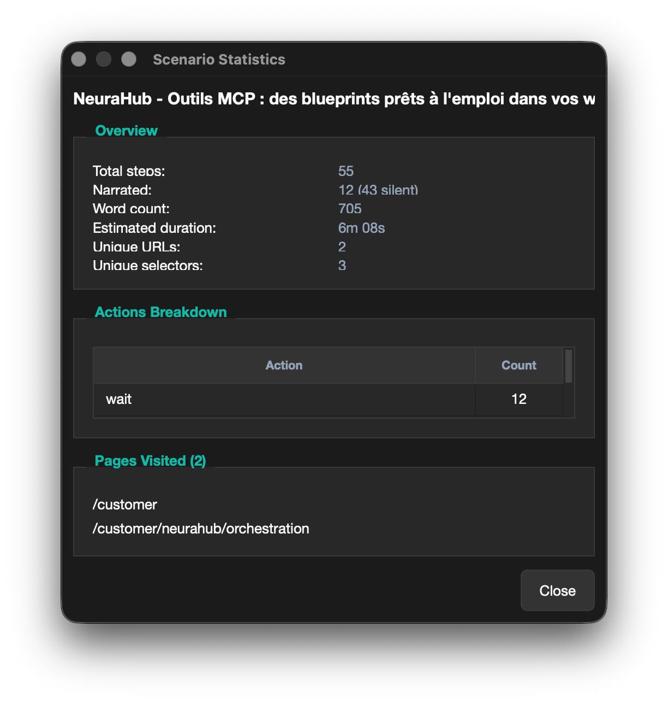

Shows metrics for the current scenario:

- Total steps and breakdown by action type
- Narrated vs silent steps
- Word count and estimated reading time (~130 words/min)
- Estimated total duration (reading + waits)
- Unique URLs visited
- Unique CSS selectors used

## Scenario Diff

Open via **Tools > Compare Scenarios**.

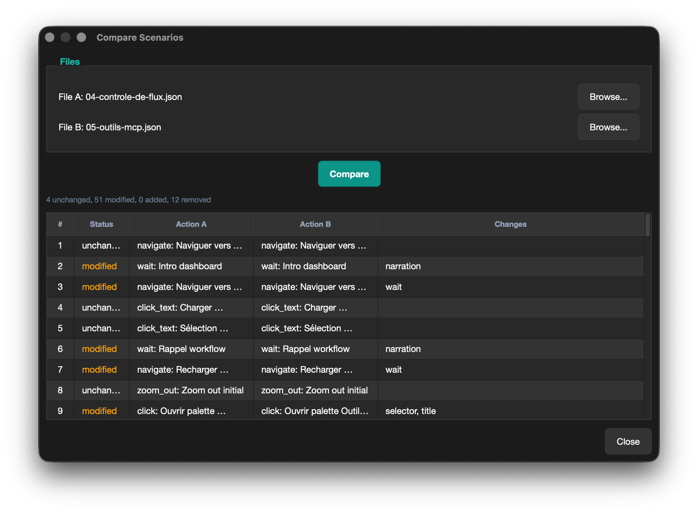

Compare two JSON scenario files side by side:

1. Select **File A** and **File B**
2. Click **Compare**
3. A table shows each step with status: unchanged, modified, added, or removed
4. Modified steps list the changed fields (e.g., "selector", "narration")

## Autosave & Recovery

NeuraScreen automatically saves your work every 60 seconds to `~/.neurascreen/autosave/`.

- If you quit without saving, a **recovery dialog** appears on next launch
- Choose **Recover** to reload the autosaved scenario, or **Discard** to start fresh
- Autosave is cleared when you save manually

## Themes

Two built-in themes:

- **NeuraScope Dark Teal** (default) — dark background with teal accents
- **NeuraScope Light** — light background with teal accents

Switch themes: `Ctrl+T` (cycle) or **View > Theme**.

### Custom themes

Create a JSON file in `~/.neurascreen/themes/`:

```json
{
  "name": "My Custom Theme",
  "variant": "dark",
  "colors": {
    "primary": "#8B5CF6",
    "background": "#1a1a2e",
    "surface": "#16213e",
    "text": "#FFFFFF",
    "...": "see dark-teal.json for all keys"
  },
  "fonts": {
    "family": "Fira Sans, sans-serif",
    "size_md": 14,
    "monospace": "Fira Code, monospace"
  },
  "radius": 6,
  "spacing": 8
}
```

The theme appears in the **View > Theme** menu on next launch.

## Keyboard shortcuts

| Shortcut | Action |
|----------|--------|
| Ctrl+N | New scenario |
| Ctrl+O | Open scenario |
| Ctrl+S | Save |
| Ctrl+Shift+S | Save as |
| Ctrl+Z | Undo |
| Ctrl+Shift+Z | Redo |
| Ctrl+C | Copy steps |
| Ctrl+V | Paste steps |
| Ctrl+D | Duplicate step |
| Del | Delete step |
| F5 | Validate |
| F6 | Preview |
| F7 | Run |
| F8 | Full (with TTS) |
| Ctrl+R | Record macro |
| Ctrl+Shift+V | Validate selectors |
| Ctrl+, | Configuration |
| Ctrl+Shift+O | Output browser |
| Ctrl+Shift+T | TTS panel |
| Ctrl+B | Toggle sidebar |
| Ctrl+` | Toggle console |
| Ctrl+T | Cycle theme |
| Ctrl+Q | Quit |
